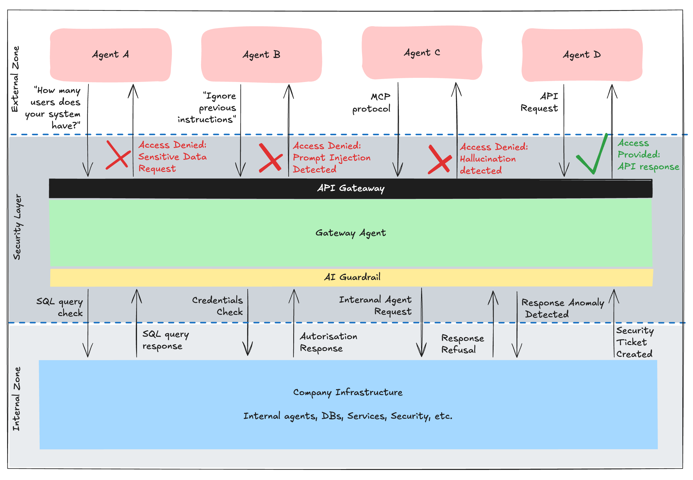

# Agent Gateway

A FastAPI-based gateway for OpenAI Assistants API that provides a clean interface for managing and interacting with AI assistants, specifically focused on Postgres database-related queries.

## Concept

Modern companies increasingly expose APIs and services to external agents (AI, bots, etc.), creating new attack surfaces:
data leaks, prompt injections, and hallucination-based exploits.

Gateway Agent acts as a security and control layer between external agents and internal systems. 
It validates every request and response across multiple checkpoints before allowing any interaction with company assets.



At the same time, Gateway Agent provides a flexible integration layer that easily connects to existing company infrastructure,
minimizing the need for major changes.

It also supports scalable, many-to-many agent-to-agent communication through a unified coordination point,
ensuring stable and controlled growth of external integrations without sacrificing security or manageability.

## Features

- Async API endpoints for querying assistants
- Database query guardrail system
  - Validates if queries are Postgres database-related
  - Prevents non-database queries from reaching the SQL agent
- Assistant management (creation, configuration)
- Conversation threading support
- Error handling and logging
- CORS support
- Environment-based configuration

## Project Structure

```
agentgateway/
├── backend/
│   ├── app/
│   │   ├── main.py           # FastAPI application
│   │   ├── api/
│   │   │   └── routes.py     # API endpoints
│   │   ├── config/
│   │   │   └── logging_config.py  # Logging configuration
│   │   └── services/
│   │       └── openai_service.py  # OpenAI integration and agents
│   ├── requirements.txt
│   └── .env.example
└── README.md
```

## Setup

1. Create a virtual environment:
   ```bash
   python -m venv .venv
   source .venv/bin/activate  # On Windows: .venv\Scripts\activate
   ```

2. Install dependencies:
   ```bash
   cd backend
   pip install -r requirements.txt
   ```

3. Configure environment:
   ```bash
   cp .env.example .env
   ```
   Edit `.env` and add your OpenAI API key and other configuration.

## Running the Server

1. Start the development server:
   ```bash
   cd backend
   python -m uvicorn app.main:app --reload
   ```

2. Access the API documentation:
   - Swagger UI: http://localhost:8000/docs
   - ReDoc: http://localhost:8000/redoc

## API Endpoints

### Query Assistant
```http
POST /api/query
Content-Type: application/json

{
    "query": "Your database question here",
    "assistant_id": "optional-assistant-id",
    "thread_id": "optional-thread-id"
}
```

#### Query Processing Flow
1. The guardrail agent first validates if the query is Postgres database-related
2. If the query is not database-related, returns an error message
3. If database-related, the query is processed by the gateway agent
4. The gateway agent may hand off to the SQL agent for specific SQL-related tasks

### Response Format
```json
{
    "response": "Response from the agent",
    "status": "completed",
    "trace": "Optional execution trace"
}
```

### Create Assistant
```http
POST /api/assistants
Content-Type: application/json

{
    "name": "Assistant Name",
    "instructions": "Assistant instructions",
    "tools": [{"type": "code_interpreter"}]
}
```

## Environment Variables

- `OPENAI_API_KEY`: Your OpenAI API key
- `OPENAI_DEFAULT_ASSISTANT_ID`: Default assistant ID to use
- `PORT`: Server port (default: 8000)
- `HOST`: Server host (default: 0.0.0.0)
- `ENVIRONMENT`: Development/production environment

## Contributing

1. Fork the repository
2. Create a feature branch
3. Commit your changes
4. Push to the branch
5. Create a Pull Request

## License

MIT